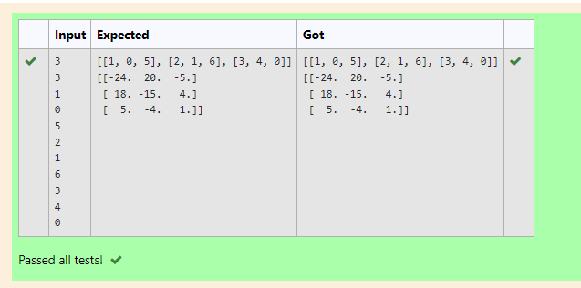

# Inverse-of-matrix

## AIM:

## ALGORITHM:
### Step 1:
### Step 2:
### Step 3:
### Step 4:
### Step 5:

## PROGRAM:
~~~
import numpy as np
l1,l2=[],[]
n1,n2=int(input()),int(input())
for i in range(n1):
    for j in range(n2):
        values=int(input())
        l1.append(values)
    l2.append(l1)
    l1=[]
print(l2)
a=np.linalg.inv(l2)
print(a)
~~~

## OUTPUT:

## RESULT:
